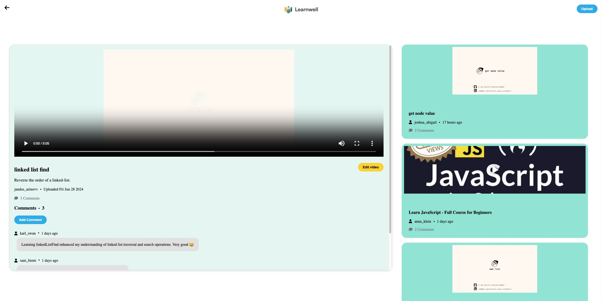

# scope-labs-assessment by Zhandos Arinov

Welcome to scope-labs-assessment by Zhandos Arinov. 
This project is a full-stack web application built using React, emphasizing educational video management and playback. It integrates with a basic server for API interactions, allowing users to manage and view educational videos. The application supports creating new video entries, commenting on videos, and full-screen playback with controls for playback speed and volume adjustment.

## Table of Contents
- [Screenshots](#screenshots)
- [Features](#features)
- [Technologies Used](#technologies-used)
- [Getting Started](#getting-started)
  - [Installation](#installation)
- [License](#license)

<h2 id="screenshots">Screenshots</h2>

Here are some screenshots of the scope-labs-assessment

### Home Page

### Single Video Page

### Upload Video Modal Page

### Add Comment Modal Page

### Edit Video Modal Page

### Search Video By Title Page

<h2 id="features">Features</h2>

- **Video Listing:** Displays a list of educational videos.
- **Video Playback:** Allows users to select and play videos with full-screen support.
- **Video Creation:** Enables users to create new video objects with titles, descriptions, and video URLs.
- **Comment Creation:** Users can leave comments on videos and view comments from others.
- **Playback Controls:** Includes options to adjust playback speed and volume for a customized viewing experience.
- **API Integration:** Fetch API used to communicate with the backend for video and comment management.

<h2 id="technologies-used">Technologies Used</h2>

- HTML5
- CSS
- JavaScript
- React.js
- React Hooks
- React Router
- React Player

<h2 id="getting-started">Getting Started</h2>

<h3 id="installation">Installation</h3>

To run the project locally, follow these steps using terminal:

1. Clone this repository: `git clone https://github.com/jandos0492/scope-labs-assessment.git`
2. Navigate to the project directory: `cd scope-labs-assessment`
3. Install the dependencies: `npm install`
4. Start the development server: `npm start`
    - The project should now be accessible in your browser at `http://localhost:3000`

<h2 id="license">License</h2>

This project is licensed under the MIT License.